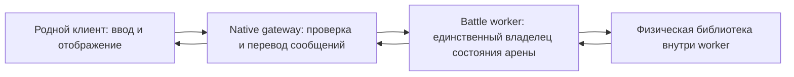

# Физика: серверная авторитетность и обязанности клиента #717

Дата: 2026-10-05. Исследование в рамках
[P02_arena_ready_countdown](../plans/P02_arena_ready_countdown.md).
Физика, движение и новый движок в этой карточке **не реализуются**.

**Решение о настоящем положении машины, столкновениях и результате действия
должен принимать сервер. Физический движок можно подключить библиотекой внутри
процесса боя; отдельный компьютер или сетевой «сервер физики» для этого не нужен.**
Это предлагаемая архитектура проекта. У родного клиента также есть собственные
физические объекты и фильтр машины; утверждение «клиент только рисует готовые
координаты и ничего физического не считает» исходникам #717 не соответствует.

## Что уже подтверждено

Разделение ниже принципиально: `VERIFIED` означает конкретный код/контракт,
`OBSERVED` — результат конкретного запуска, `INFERRED` — проверяемый вывод,
`UNKNOWN` — недостающие сведения. Статическое наличие метода не доказывает,
что его ветка уже выполнена нашим сетевым стендом.

| Статус | Факт | Доказательство |
|---|---|---|
| VERIFIED | `VehicleAppearance.start` создаёт `BigWorld.WGVehicleFilter` и назначает его машине | original `res/scripts/client/VehicleAppearance.pyc`, исходная строка426, CALL102/STORE114 |
| VERIFIED | `Vehicle.startVisual` вызывает создание `WGVehiclePhysics`; объект получает параметры через `physics_shared.initVehiclePhysics` и связывается с фильтром | original `Vehicle.pyc`:562 CALL328; :715 CALL15/45/164 |
| VERIFIED | Клиентский `initVehiclePhysics` задаёт центр масс, пределы скорости, gravity, сопротивления грунта и параметры пружин | original `res/scripts/common/physics_shared.pyc`:254, STORE423/1001/1010/1556/1936, `addDamperSpring` ATTR2453 |
| VERIFIED | Обработка ввода обращается и к локальному фильтру, и к native base-методу | original `Avatar.pyc`, `PlayerAvatar.moveVehicle`:2130: `filter.notifyInputKeysDown` CALL291, `base.vehicle_moveWith(flags)` CALL338 |
| VERIFIED | Есть отдельные пути синхронизации углов орудия и изменения позиции фильтра | original `Vehicle.pyc`, `set_gunAnglesPacked`:354 CALL74; `onPushed`:424 CALL57, с условием по расстоянию |
| OBSERVED | Vehicle03 загрузил свою машину, модели и Battle/HUD настоящим клиентом; это неподвижный лабораторный checkpoint | [Независимый native отчёт](../../local/evidence/20261005-p02-arena-entry/data/verify-vehicle03-final-01/arena-vehicle-native-verification.json), 17/17 PASS; движение, контакт с грунтом и передача ammo в Avatar NOT_RUN |
| UNKNOWN | Точные алгоритмы внутри native фильтра: интерполяция, экстраполяция, предсказание, история входов и исправление ошибок | Python-обвязка вызывает встроенный API, но не раскрывает его C++ алгоритм; нужного динамического измерения нет |

Пять исходных файлов прочитаны только из оригинала. Десять методов и17 точных
bytecode anchors повторно сверены безопасным статическим читателем; клиентский
код не исполнялся. Полные SHA-256, относительные пути, инструкции и результат:
[source manifest](../../local/evidence/20261005-p02-arena-ready/physics/collection-01/source-manifest.json),
[выбранные методы](../../local/evidence/20261005-p02-arena-ready/physics/collection-01/original-methods.json),
[проверки](../../local/evidence/20261005-p02-arena-ready/physics/collection-01/result.json).
Например, `physics_shared.pyc` имеет SHA-256
`487e2453c8e4540a9921353ebe651e833fd4145a1cc0623d70927cbb57863a77`.
Производные данные оригинала остаются в игнорируемом `local/`.

## Как разделить работу в нашем сервере

Следующая схема — **предложение**, уже согласованное с
[архитектурой](../02_ARCHITECTURE.md), а не описание исторического сервера:



Worker проверяет команды авторизованной машины, применяет правила движения и
получает из библиотеки контакты/новое физическое состояние. Он же определяет
разрешённое состояние мира, повреждения, видимость и результат. Сетевые номера
native методов остаются в gateway; физика получает внутренние команды и данные.
Никакие клиентские координаты, часы или заявления о попадании не становятся
истиной только потому, что пакет корректно расшифровался.

Одна арена целиком принадлежит одному worker. Позже независимые арены можно
распределять по процессам и машинам после измерений нагрузки. Дополнительный
сетевой сервис для каждого физического шага сейчас лишь добавил бы границы
синхронизации и отказов; необходимости в нём не установлено. Отдельный компонент
в коде нужен, отдельная физическая машина — не обязательна.

У клиента остаются рендер, звук, эффекты, ввод и родные filter/physics hooks.
**INFERRED:** эти hooks могут участвовать в локальном сглаживании или
предсказании движения. Конкретное разделение своего и чужого танка,
периодичность и способ коррекции ещё нужно измерить. При несовпадении модели
возможны рывки и постоянные исправления; принимать произвольную позицию клиента
ради красивой картинки нельзя.

## Что означает имеющийся Jolt spike

Jolt — **кандидат**, а не утверждённая исторически совместимая физика. Актуальная
официальная документация показывает `TrackedVehicleController` с управлением
движением, соотношением скоростей гусениц и тормозом. Это наличие подходящего
API, не доказательство поведения машины #717.
[Официальный API](https://jrouwe.github.io/JoltPhysics/class_tracked_vehicle_controller.html).

Наш прежний самостоятельный headless-процесс действительно запустил
`JoltPhysicsSharp 2.22.0 / JoltPhysics.Native 1.1.0` на .NET9.0.17/Windows x64:
синтетический шар упал на статический параллелепипед, прошёл300 шагов по1/60s,
получил один контакт и остановился на Y=0.4860385. Ошибки шага, отсутствие
контакта и недопустимая высота проверялись. Это **OBSERVED/PASS данного spike**,
без рендера; переисполнение в этой карточке **NOT_RUN**.
[Код](../../tools/physics_spike/Program.cs),
[закреплённые зависимости](../../tools/physics_spike/packages.lock.json),
[сохранённый результат](../../local/evidence/20261002-p00-p01/physics-result.json).

Наличие C#-типа гусеничного контроллера проверено, но его симуляция, импорт
collision-геометрии карты, машина на склоне, движение по мосту, столкновение
танков, replay и согласование с native фильтром — **NOT_RUN**. Сам локальный
spike помечает историческую физику `NOT_TESTED`. net9.0 был доступной средой
эксперимента; окончательный production стек этим не выбран.

Официальная документация Jolt связывает повторяемость с порядком изменений
мира и сборкой; межплатформенный режим имеет отдельные требования и оговорки,
включая порядок callback/query results. Это не заменяет проверку нашей
закреплённой версии и платформы. Битовую идентичность Windows/Linux/x86/ARM
мы **не проверяли и не обещаем**.
[Условия Jolt](https://github.com/jrouwe/JoltPhysics/blob/master/Docs/Architecture.md#deterministic-simulation).
Список просмотренных первичных источников и границы выводов:
[official-sources.json](../../local/evidence/20261005-p02-arena-ready/physics/official-sources.json).

## Чего библиотека сама не решает

Нужно отдельно установить исторические параметры и правила контроллера,
единицы/оси/коллизии импортированной карты и родной формат обновления движения.
Геометрия опоры корпуса и геометрия брони/экранов для попаданий решают разные
задачи. Перезарядка, боекомплект, баллистика, пробитие, damage и visibility
остаются серверными правилами, а не автоматическим следствием подключения
Jolt. Значения из дескриптора не восстанавливают весь исторический алгоритм.
[Правила исследования](../04_RULESET_091.md).

## Проверка, повтор и границы

Выполнено в этой части: read-only проверка5 оригинальных файлов/10 методов/
17 anchors, хеширование названных источников и сохранённых результатов,
чтение текущей официальной документации. Результат **PASS_READONLY_RESEARCH**.
Новых зависимостей, серверной физики, клиентских изменений, процессов или
изменений БД нет. Приёмка сетевого движения и исторической физики **NOT_RUN**.

Повторить только сбор доказательств из корня проекта в новый каталог:

```powershell
python -B -X utf8 local/evidence/20261005-p02-arena-ready/physics/collect_physics_evidence.py --out local/evidence/20261005-p02-arena-ready/physics/collection-repeat-01
```

Команды прежнего spike приведены в [REPRODUCE](REPRODUCE.md); они здесь повторно
не запускались. Откат этой документационной части: убрать только новый
`PHYSICS_AUTHORITY.md`; доказательства можно сохранить. Рабочее состояние
клиента, сервера и аккаунтов эта часть не меняет.

**Один следующий проверяемый шаг после текущего отсчёта арены:** отдельный
ограниченный native эксперимент с одной командой движения своего МС-1 и
серверным обновлением положения, с фиксацией реального wire и реакции фильтра.
Он должен установить путь команды и коррекции, прежде чем выбирать или
настраивать полноценный контроллер. Этот эксперимент пока **NOT_RUN**.
